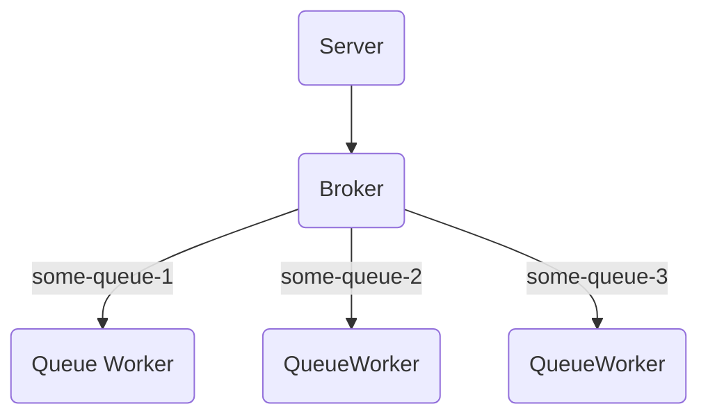

# Simplest message broker. 

Implement subscription and message sending to a queue via HTTP protocol. 
Ensure delivery guarantee: a message will be removed from the queue only upon receipt by all subscribers.

How to run:
```go
func main() {
	ctx, stop := signal.NotifyContext(context.Background(), syscall.SIGINT, syscall.SIGTERM)
	defer stop()

	srv := server.NewHttpServer("localhost:8090", mule.Config{{
		QueueName: "test",
		Size:      10,
		SubsSize:  10,
	}})
	go func() {
		defer stop()
		err := srv.Start()
		if err != nil {
			log.Println("server start err:", err)
			return
		}
	}()
	defer func() { _ = srv.Stop(ctx) }()
	<-ctx.Done()
}
```

How to add new message:
```
curl -X POST \
     -H 'Content-Type: application/json' \
     -d '{"your": "body","can": "be","here": "as JSON"}' \
http://localhost:8090/v1/queues/test/messages
```

How to add subscription:
```
curl -X POST http://localhost:8090/v1/queues/test/subscriptions
```

Run project:
```
make
./application
```

Code structure:

The main project code is located in pkg/mule. 
The code for working with the broker and the server providing the API is separated. 
We use only one implementation for the server (HTTP protocol), but there could be any other.

The broker contains several instances of QueueWorker (one instance per queue). 
For guaranteed message delivery, a SyncQueue is used, from which messages are removed only after receipt by all subscribers.

Schema:
